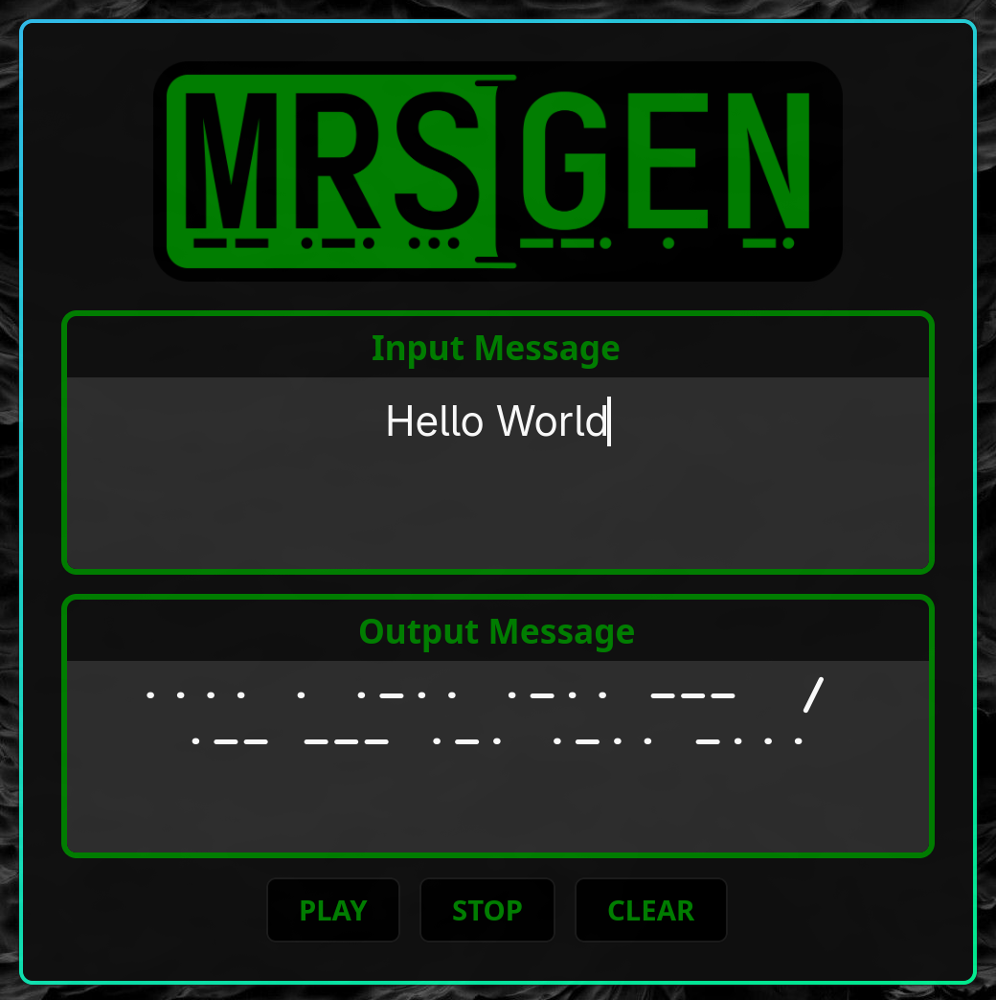

# Morse
---
A simple morse code generator for translating from english to morse.
Uses pygame to generate tones and PyGObject Gtk 4 bindings for the ui.



# Dependencies
- python3
- PyGObject
- pygame
- Gtk 4 

# Install with uv
Install uv if needed

```
curl -LsSf https://astral.sh/uv/install.sh | sh
```

Verify installation

```
uv self version
```

Move to directory you want to download to

```
cd path/to/directory
```

Clone the repo

```
git clone https://github.com/jdfincher/mrsgen
```

Move to mrsgen root directory

```
cd mrsgen
```

Initialize uv version

```
uv venv
```

Activate venv

```
source .venv/bin/activate
```

Include your already installed system packages in the venv by navigating to the .venv directory and edit the pyvenv.cfg file

```
cd .venv
nvim pyvenv.cfg
```

Change this line to true

`include-system-site-packages = true`

Check if GTK4 instropection packages are installed

### Arch 

``` bash#
pacman -Qs '^gtk4$|^gobject-introspection$|^python(-|)gobject' >/dev/null \
&& echo "GTK4 introspection packages are installed." \
|| echo "GTK4 introspection packages are NOT installed."
```

### Debian/Ubuntu

``` bash#
dpkg -s libgtk-4-dev gir1.2-gtk-4.0 python3-gi python3-gi-cairo >/dev/null 2>&1 \
&& echo "GTK4 introspection packages are installed." \
|| echo "GTK4 introspection packages are NOT installed."
```

Install and update if needed

``` bash#
sudo pacman -Syu --needed gtk4 gobject-introspection python-gobject
```

### Debian/Ubuntu

``` bash#
sudo apt update
sudo apt install -y libgtk-4-dev gir1.2-gtk-4.0 python3-gi python3-gi-cairo
```

Sync dependencies (pygame,numpy,pycairo,pygobject)

```
uv sync
```

Run with

```
./main.sh
```


